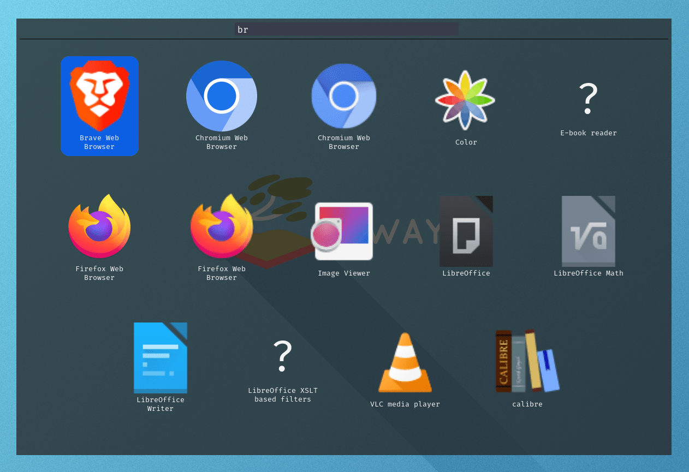
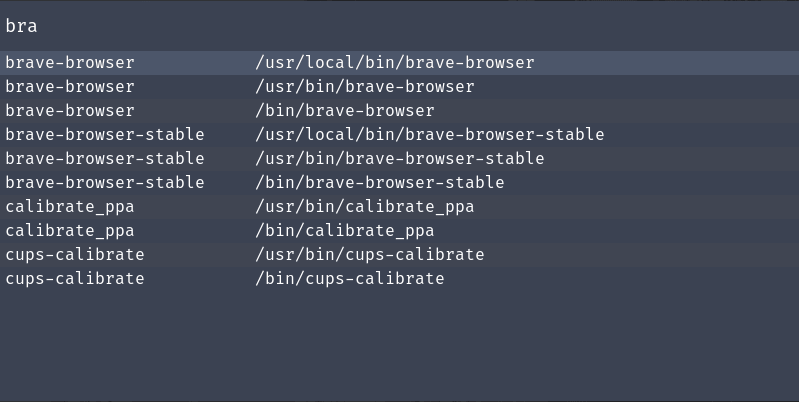
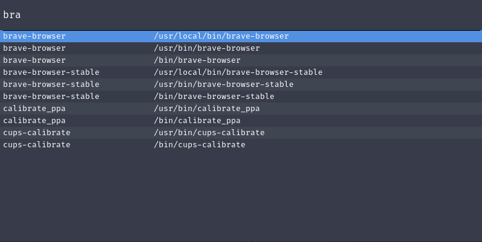
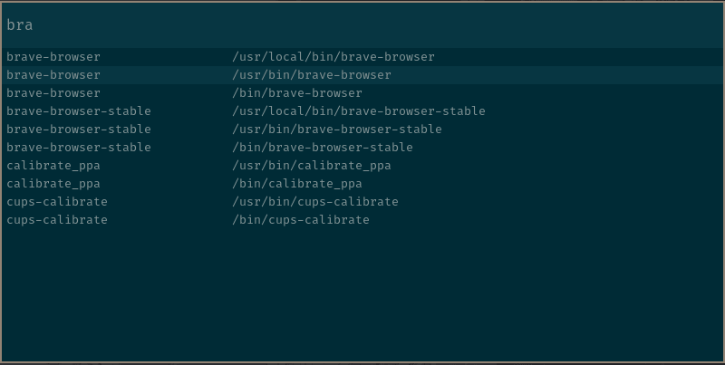
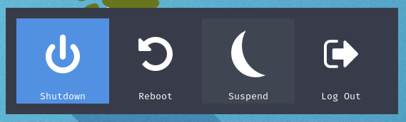

## RMenu

<!--
 TODO: improve documentation:
  2. explain exchange format and rmenu-build tool
  3. include more examples including fullscreen/transparent app-window
-->

Another customizable Application-Launcher written in Rust

### Features

- Blazingly Fast 🔥
- Simple and Easy to Use
- Customizable (Configuration and CSS-Styling)
- Plugin Support
- Dmenu-Like Stdin Menu Generation

### Installation

RMenu now has Nix support thanks to
[@LordGrimmauld](https://github.com/LordGrimmauld)!

Install Dependencies (Ubuntu)

```bash
sudo apt install pkg-config libglib2.0-dev libghc-gi-gdk-dev libsoup-3.0-dev libjavascriptcoregtk-4.1-dev libwebkit2gtk-4.1-dev libnm-dev
```

Compile and Install Binaries/Config-Files

```bash
$ make install
```

### Usage

View all available options with the builtin help:

```bash
$ rmenu --help
```

RMenu Comes with a few default plugins.

|   Name    | Description                                             |
| :-------: | ------------------------------------------------------- |
|    run    | Execute a program in $PATH                              |
|   drun    | Run a Configured Free-Desktop Application               |
|   audio   | Select and Set-Default PulseAudio Sink using `pactl`    |
|  network  | Wi-Fi Login/Connection Tool using Network-Manager       |
|  window   | Simple Window Switcher (Currently Only Support Sway)    |
| powermenu | Simple Power/Logout Tool (Currently Only Supports Sway) |

Run a plugin by passing the `-r` flag like one of the following:

```bash
$ rmenu -r run
$ rmenu -r drun
$ rmenu -r audio
```

Or even run plugins in combination if you'd like:

```bash
$ rmenu -r run -r drun
```

Custom Menus can also be passed much like Dmenu by passing items via an input.
The schema follows a standard as defined in [rmenu-plugin](./rmenu-plugin)

```bash
$ generate-my-menu.sh > input.json
$ rmenu -i input.json
```

When neither a plugin nor an input are specified, rmenu defaults to reading from
stdin.

```bash
$ generate-my-menu.sh | rmenu
```

### Configuration

Customize RMenu Behavior and Appearal in a
[single config](./rmenu/public/config.yaml)

Customize the entire app's appearance with CSS. A few
[Example Themes](./themes/) are available as reference. To try them out use:
`rmenu --css <my-css-theme>` or move the css file to
`$HOME/.config/rmenu/style.css`

### Scripting

RMenu plugins and imports communicate using JSON messages defined in
`rmenu-plugin`. Writing JSON in shell is painful, so rmenu provides another
cli-tool to help build messages quickly and easily while still retaining the
flexibility of JSON.

After Installing. Use the following command, and look at
[other-plugins](./other-plugins) for example uses.

```
$ rmenu-build --help
```

### Example Screenshots

#### Launchpad



#### Nord



#### Dark



#### Solarized



#### PowerMenu


